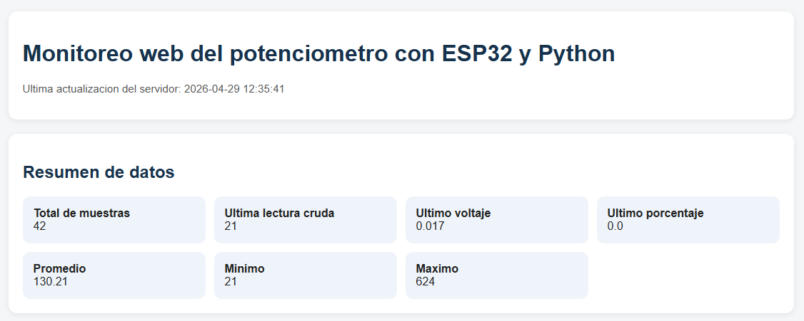
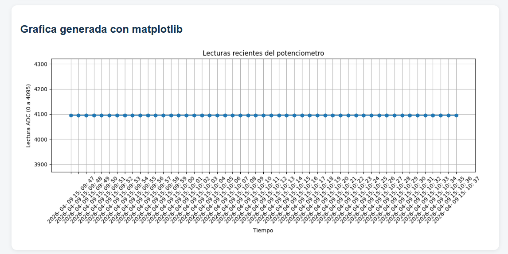
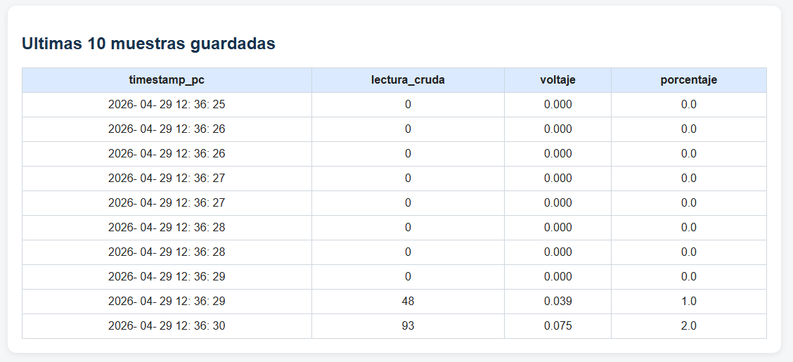

<h1 align="center">▣ Sistema de Adquisición y Visualización de Datos con ESP32</h1>

<p align="center">
Lectura de un potenciómetro con ESP32, almacenamiento en CSV y visualización web con Flask y Matplotlib.
</p>

---

## ▧ Descripción General

Este proyecto implementa un sistema completo de adquisición, procesamiento y visualización de datos analógicos utilizando una **ESP32**.

El sistema captura el valor de un potenciómetro, lo transmite por comunicación serial, lo procesa en Python y lo muestra en una interfaz web mediante una gráfica generada dinámicamente.

---

## ⇄ Flujo del Sistema

1. La ESP32 lee el valor del potenciómetro (ADC)  
2. Envía los datos por el puerto serial  
3. Python recibe los datos  
4. Se limpian valores erróneos o ruido  
5. Se guardan en un archivo CSV  
6. Flask lee el CSV  
7. Se genera una gráfica con Matplotlib  
8. La gráfica se muestra en una página web  

---

## ▣ Materiales

- ESP32  
- Cable USB  
- Potenciómetro  
- 3 cables (jumpers)  

---

## ⚙ Tecnologías Utilizadas

- Python  
- Flask  
- Matplotlib  
- Comunicación Serial  
- HTML  

---

## ▦ Estructura del Proyecto

```bash
proyecto/
│── ESP.py
│── serial_a_csv.py
│── app_flask.py
│── Flask_prueba.py
│── datos_potenciometro.csv
│
├── static/
│   └── grafica.png
│
└── templates/
    └── index.html
```

## 📄 Descripción de Archivos

ESP.py = realiza la lectura de datos del potenciómetro y los envía por serial, se carga en el microcontrolador  

serial_a_csv.py = convierte la lectura del serial y la guarda en un archivo .csv, limpia los datos de ruido o no relevantes  

app_flask.py = lee el csv y grafica la imagen con matplotlib, genera la conexión con el servidor y carga el archivo HTML desde la carpeta templates  

Flask_prueba.py = es un ejemplo de una web Flask  

datos_potenciometro.csv = contiene los datos del potenciómetro leídos por la ESP, en este caso está lleno de datos cercanos a 0  

Carpeta static = donde se almacena la gráfica de matplotlib, debe llamarse así para que Flask la reconozca  

Carpeta templates = contiene la plantilla HTML de la página web, incluyendo el archivo index.html  

## Demostración

Imagenes de ejemplo en las cuales se puede visualizar el resultado esperado de la ejecución de la pagina web.
<p align="center">
  
</p>

<p align="center">
  
</p>

<p align="center">
  
</p>
