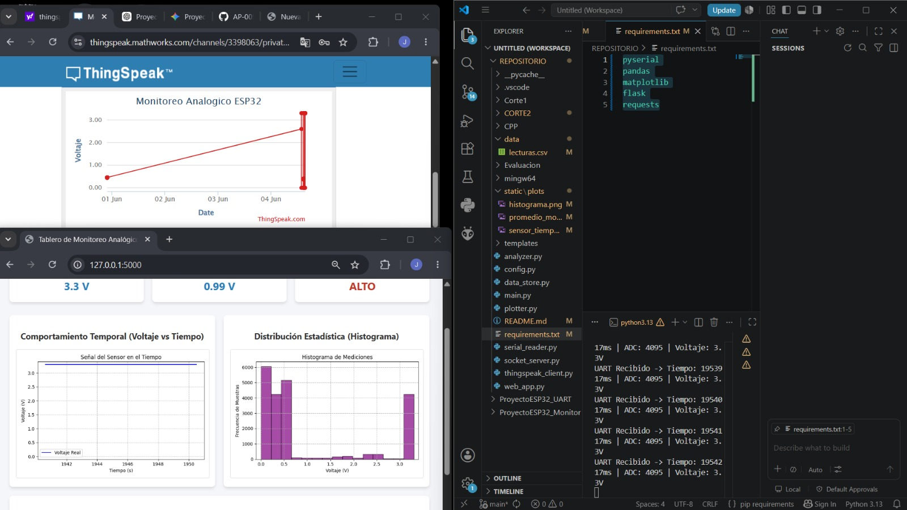

# Sistema de Monitoreo Analógico - ESP32

Este proyecto lee una señal analógica desde un potenciómetro conectado al **GPIO 34** de un ESP32 (resolución de 12 bits, rango 0-4095) y procesa los datos en Python usando una arquitectura multihilo.

## Estructura del Proyecto
* `main.py`: Orquestador de hilos del sistema.
* `config.py`: Parámetros globales y bloqueo `Lock` de seguridad.
* `serial_reader.py`: Recibe los datos por el puerto `COM5`.
* `data_store.py`: Guarda el histórico en `data/lecturas.csv`.
* `analyzer.py` y `plotter.py`: Generan estadísticas y gráficas PNG con Pandas y Matplotlib.
* `socket_server.py`: Servidor TCP en el puerto `9000` para enviar datos JSON a aplicaciones externas.
* `thingspeak_client.py`: Sube datos a la nube de ThingSpeak cada 15 segundos.
* `web_app.py`: Servidor Flask que corre el Dashboard local en el puerto `5000`.

## Instalación y Execución
1. Instala las dependencias:
   ```bash
   pip install -r requirements.txt
## Evidencia de Funcionamiento

